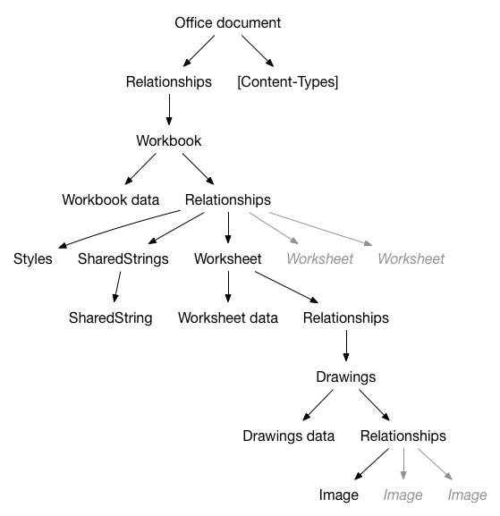

#XlsxReaderWriter

XlsxReaderWriter is an Objective-C library for iPhone / iPad. It parses and writes Excel OpenXml files (XLSX).

##Features

XlsxReaderWriter is able to:

* Read a spreadsheet document (XLSX file)
* Save a spreadsheet document
* Create worksheet
* Copy worksheet
* Remove worksheet
* Read cells content (Formula, error, string, attributed string, formatted number, boolean, date)
* Write cells content (Formula, error, string, attributed string, formatted number, boolean, date)
* Get images
* Add images (JPEG or PNG)
* Add/remove rows in sheets
* Add/remove columns in sheets
* Change number formatting
* Read content from merge cells
* Get cell fill as a UIColor
* Change cell fill
* ... many other things

Todo:

* Add/remove columns in sheets
* Create spreadsheet document from scratch
* Improve number formatting
* Borders

##Limitation

XlsxReaderWriter can't create a SpreadsheetML (XLSX) file from scratch. You have to open an existing file and modify it before saving it. Not really a problem : You create your file with Excel or Numbers with all the needed formatting (fills, borders, etc.) then include the file as a resource of your project.

##Third parties

Third parties are included in this repository, not linked as git submodules.

* SSZipArchive: Compression/decompression library
* XMLDictionary: Converts XML to NSDictionary and NSDictionary to XML

##Linking

To include the library to your Xcode project, insert XlsxReaderWriter.xcodeproj as a sub project of your project. In your target "Build phases" insert XlsxReaderWriter as a target dependecy and add libXlsxReaderWriter.a in "Link binary with Libraries".

Now, you can import BRAOfficeDocumentPackage.h in your code.

##How to 

####Read a spreadsheet document (XLSX file)

    NSString *documentPath = [[NSBundle mainBundle] pathForResource:@"testWorkbook" ofType:@"xlsx"];
	BRAOfficeDocumentPackage *spreadsheet = [BRAOfficeDocumentPackage open:documentPath];

####Save a spreadsheet document

	//Save
	[spreasheet save];
	
	//Save a copy
    NSString *fullPath = [[NSSearchPathForDirectoriesInDomains(NSDocumentDirectory, NSUserDomainMask, YES) lastObject] stringByAppendingPathComponent:@"workbookCopy.xlsx"];
    [spreadsheet saveAs:fullPath];

####Get a worksheet

	//First worksheet in the workbook
	BRAWorksheet *firsWorksheet = spreadsheet.workbook.worksheets[0];
	
	//Worksheet named "Foo"
	BRAWorksheet *fooWorksheet = [spreadsheet.workbook createWorksheetNamed:@"Foo"];

####Read cells content: Formula

	NSString *formula = [[worksheet cellForCellReference:@"B4"] formulaString]

####Read cells content: error

	NSString *errorValue = nil;
	if ([[worksheet cellForCellReference:@"B2"] hasError]) {
		errorValue = [[worksheet cellForCellReference:@"B2"] stringValue];
	}
	
####Read cells content: string

	NSString *string = [[worksheet cellForCellReference:@"B6"] stringValue];

####Read cells content: attributed string

	//Cell style is applied to the cell content
	NSAttributedString *attributedString = [[worksheet cellForCellReference:@"B5"] attributedStringValue];

####Read cells content: formatted number

	//Integer cell value
	NSInteger cellIntValue = [[worksheet cellForCellReference:@"B5"] integerValue];

	//Float cell value
	CGFloat cellFloatValue = [[worksheet cellForCellReference:@"B5"] floatValue];

	//Formatted number cell value
	CGFloat cellFloatValue = [[worksheet cellForCellReference:@"B5"] stringValue];

####Read cells content: boolean

	BOOL cellTruth = [[worksheet cellForCellReference:@"B5"] boolValue];
	
####Write cells content: Formula

    [[worksheet cellForCellReference:@"Y26" shouldCreate:YES] setFormulaString:@"TODAY()"];

####Write cells content: error

    [[worksheet cellForCellReference:@"Y27" shouldCreate:YES] setError:@"#DIV/0!"];

####Write cells content: string

    [[worksheet cellForCellReference:@"Y24" shouldCreate:YES] setStringValue:@"FOO / BAR"];

####Write cells content: attributed string

    [[worksheet cellForCellReference:@"Z24" shouldCreate:YES]
     setAttributedStringValue:[[NSAttributedString alloc] initWithString:@"RED is not GREEN" attributes:@{NSForegroundColorAttributeName: [UIColor greenColor]}]];

####Write cells content: formatted number

    [[worksheet cellForCellReference:@"Z23" shouldCreate:YES] setFloatValue:12.3];
    [[worksheet cellForCellReference:@"Z23"] setNumberFormat:@"0.000"];

####Write cells content: boolean

    [[worksheet cellForCellReference:@"Z21" shouldCreate:YES] setBoolValue:NO];

####Write cells content: date

	NSDateFormatter *df = [[NSDateFormatter alloc] init];
    df.dateFormat = @"MM/dd/yyyy";
    [[worksheet cellForCellReference:@"Y25" shouldCreate:YES] setDateValue:[df dateFromString:@"10/07/1982"]];
    [[worksheet cellForCellReference:@"Y25"] setNumberFormat:@"m/d/yyyy"];

####Get cell fill as a UIColor

	UIColor *cellFillColor = [[worksheet cellForCellReference:@"A35"] cellFillColor];

####Change cell fill

	[[worksheet cellForCellReference:@"A36" shouldCreate:YES] setCellFillWithForegroundColor:[UIColor yellowColor] backgroundColor:[UIColor blackColor] andPatternType:kBRACellFillPatternTypeDarkTrellis];
	
####Get images

	//Works with oneCellAnchor or twoCellAnchored image
	UIImage *image = [worksheet imageForCellReference:@"G8"].uiImage;

####Add images (JPEG or PNG)

	UIImage *image = [UIImage imageNamed:@"Kitten.jpeg"];
	//preserveTransparency force JPEG (NO) or PNG (YES)
    BRAWorksheetDrawing *drawing = [worksheet addImage:image betweenCellsReferenced:@"G2" and:@"I10"
                                            withInsets:UIEdgeInsetsZero preserveTransparency:NO];
	//Set drawing insets (percentage)
    drawing.insets = UIEdgeInsetsMake(0., 0., .5, .5);

####Add/remove rows in sheets

	//Insert one row before 18th row
    [worksheet addRowsAt:18];
	//Remove it
	[worksheet removeRow:18]

	//Insert 10 rows before 18th row
    [worksheet addRowsAt:18 count:10];
	//Remove them
	[worksheet removeRow:18 count:10];

####Add/remove columns in sheets

	TODO
	
####Change number formatting

	[[worksheet cellForCellReference:@"Y25"] setNumberFormat:@"_(0.00_);(0.00)"];
	
####Read content from merge cells

	//Get the cell at C10 or the upper-left cell if C10 belongs to a merge cell
	BRACell *cell = [worksheet cellOrFirstCellInMergeCellForCellReference:@"C10"]

####Create worksheet

	BRAWorksheet *worksheet = [spreadsheet.workbook createWorksheetNamed:@"Foo"];

####Copy worksheet

	BRAWorksheet *worksheetToCopy = spreadsheet.workbook.worksheets[0];
    BRAWorksheet *worksheet = [spreadsheet.workbook createWorksheetNamed:@"Foo" byCopyingWorksheet:worksheetToCopy];

####Remove worksheet
	
	[_spreadsheet.workbook removeWorksheetNamed:@"Foo"];

##A word about XLSX files

XLSX files are OPC packages (see ECMA-376 for more information). Below is a simplified hierarchical representation of the package contents.

Files have relationships, files are relationships... Have a look at this picture each time you want to change something in the library.

##Tests coverage

A test coverage script run at the end of tests. You need to install LCOV via Macports to run coverage report generation.

Reports will be put in /Users/Shared/Coverage.

I use a custom CSS for LCOV. Put yours at this path : /Users/Shared/Coverage/gcov.css

##License	

Copyright (c) 2014 Ren&eacute; BIGOT.

The XlsxReaderWriter library should be accompanied by a LICENSE file. This file contains the license relevant to this distribution. If no license exists, please contact me [@renebigot](https://twitter.com/renebigot).
